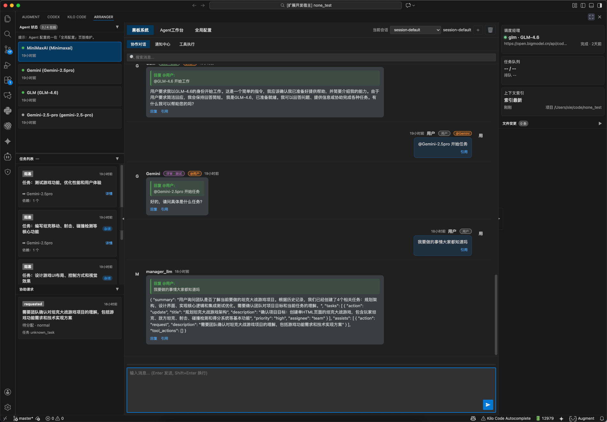
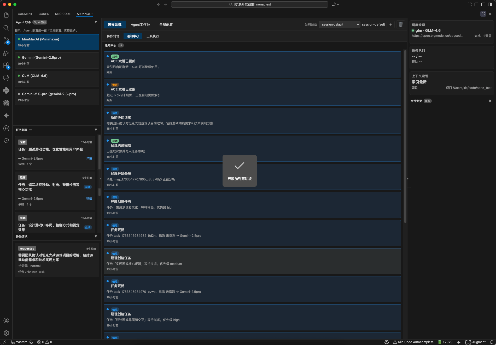
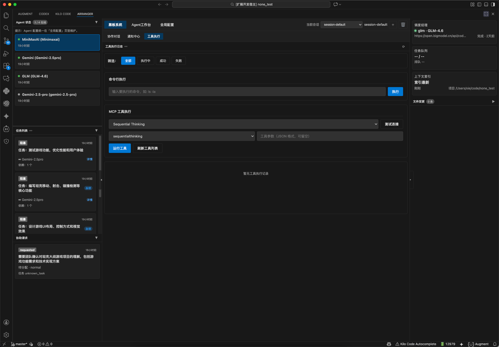
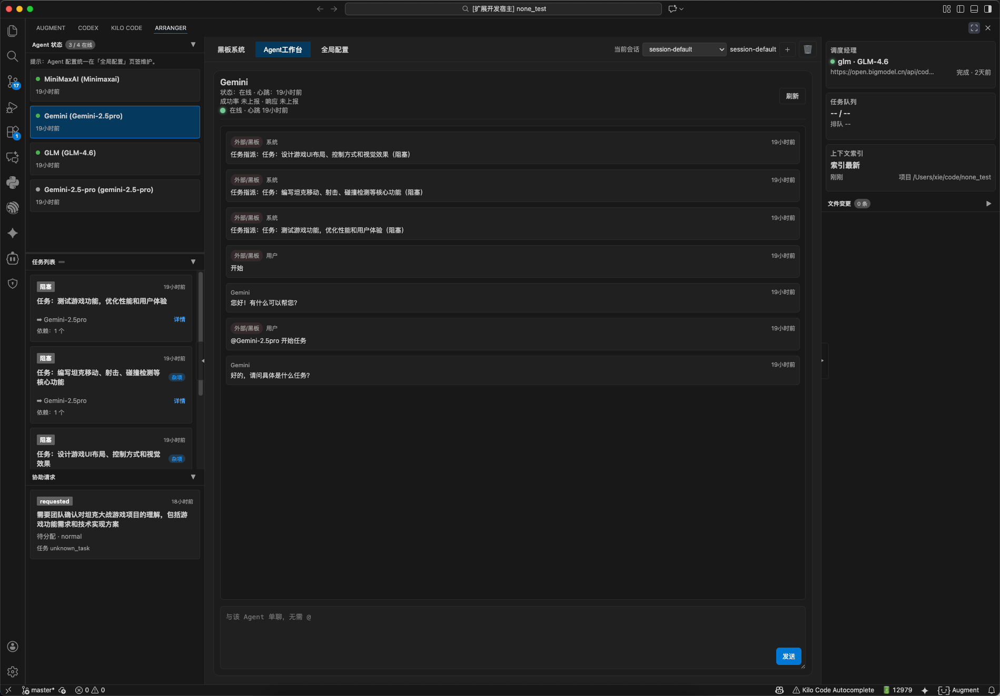
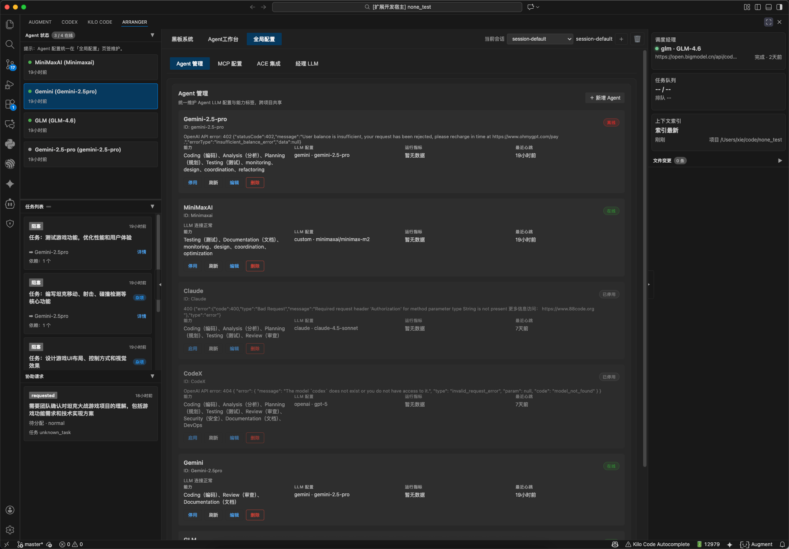
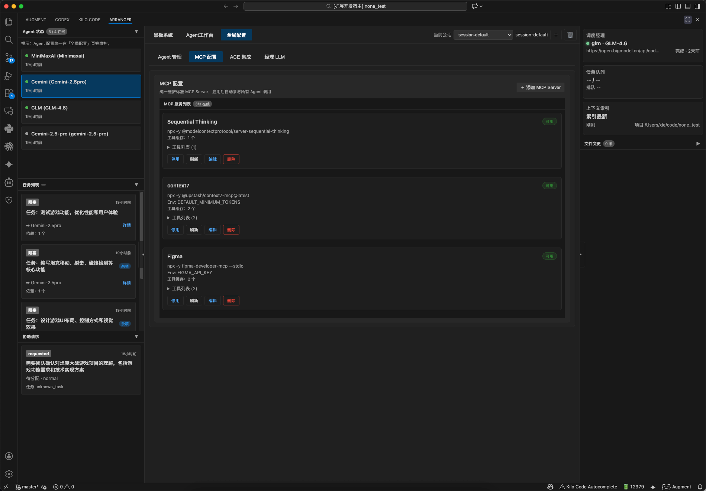
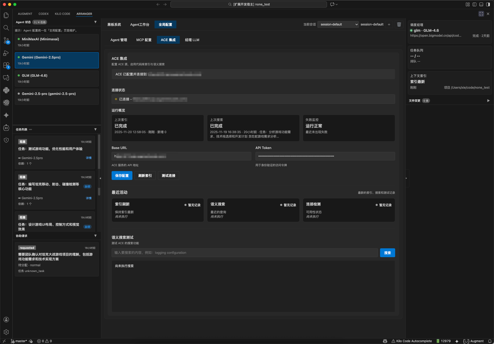
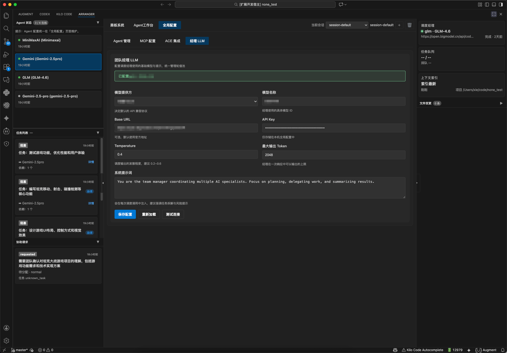

# Arranger VSCode Extension

Arranger VSCode 插件 - 基于多 LLM 智能编排的团队级代码助手。

## 概述

VSCode Arranger 是一个**基于多 LLM 智能编排的团队级代码助手**。它突破了传统单 Agent 助手的限制，通过构建一个由"经理"（Manager）和具备不同能力标签的"成员"（Workers）组成的虚拟研发团队，为开发者提供具备统筹规划、分工协作和自我纠错能力的智能编程体验。

## 核心特性

### 🎯 智能团队协作
- ✅ **多 Agent 架构** - 经理+成员的虚拟团队模式
- ✅ **智能任务调度** - 基于能力匹配和负载均衡的任务分配
- ✅ **协作机制** - Agent 间协助请求和结果共享
- ✅ **状态编排** - 统一的状态管理中心（SSOT）

### 🛠️ 强大的工具集成
- ✅ **统一工具接口** - 本地命令、MCP 工具、ACE 搜索统一调用
- ✅ **安全控制** - 三级风险控制策略，敏感操作需用户确认
- ✅ **审计日志** - 完整的执行记录和性能监控
- ✅ **错误恢复** - 智能重试和错误处理机制

### 🎨 沉浸式用户界面
- ✅ **黑板协作界面** - 群聊模式的团队协作空间
- ✅ **Agent 工作台** - 单聊模式的专注工作环境
- ✅ **思维链可视化** - Agent 思考过程的透明展示
- ✅ **实时状态同步** - 任务进度和系统状态实时更新

### 🧠 智能上下文感知
- ✅ **ACE 集成** - 全项目代码语义索引
- ✅ **对话记忆** - 跨会话的上下文保持
- ✅ **智能关联** - 自动关联相关代码和文档
- ✅ **上下文压缩** - 长对话的智能摘要

### 🔒 安全与隐私
- ✅ **本地优先** - 所有数据存储在用户本地
- ✅ **密钥加密** - API 密钥使用 VSCode SecretStorage 加密
- ✅ **网络隔离** - 除 LLM API 调用外不向外发送数据
- ✅ **权限控制** - 细粒度的操作权限管理

## 安装

### 从 Marketplace 安装

在 VSCode 中搜索 "Arranger" 并安装。

### 本地开发

```bash
npm install
npm run dev
```

按 `F5` 启动调试模式。

## 系统架构

### 分层架构设计

```
┌─────────────────────────────────────────────────────────┐
│                   表现层 (Presentation)                    │
│  ┌─────────────┐ ┌─────────────┐ ┌─────────────┐         │
│  │ 黑板界面     │ │ Agent工作台 │ │ 配置中心     │         │
│  │ (群聊模式)   │ │ (单聊模式)   │ │             │         │
│  └─────────────┘ └─────────────┘ └─────────────┘         │
└─────────────────────────────────────────────────────────┘
                              │
┌─────────────────────────────────────────────────────────┐
│                   应用层 (Application)                    │
│  ┌─────────────┐ ┌─────────────┐ ┌─────────────┐         │
│  │ 经理编排服务 │ │ Agent管理服务│ │ 工具执行服务 │         │
│  └─────────────┘ └─────────────┘ └─────────────┘         │
└─────────────────────────────────────────────────────────┘
                              │
┌─────────────────────────────────────────────────────────┐
│                    领域层 (Domain)                       │
│  ┌─────────────┐ ┌─────────────┐ ┌─────────────┐         │
│  │ 状态编排层   │ │ 任务状态机   │ │ Agent执行引擎│         │
│  │   (SSOT)    │ │             │ │             │         │
│  └─────────────┘ └─────────────┘ └─────────────┘         │
└─────────────────────────────────────────────────────────┘
                              │
┌─────────────────────────────────────────────────────────┐
│                 基础设施层 (Infrastructure)                │
│  ┌─────────────┐ ┌─────────────┐ ┌─────────────┐         │
│  │ SQLite数据库│ │ LLM客户端池 │ │ ACE索引引擎 │         │
│  └─────────────┘ └─────────────┘ └─────────────┘         │
└─────────────────────────────────────────────────────────┘
```

## 配置

打开 VSCode 设置（`Cmd+,` 或 `Ctrl+,`），搜索 "Arranger"：

### LLM 配置

- **Provider** - LLM 提供商（Claude/OpenAI/GLM/Gemini/Ollama）
- **API Key** - API 密钥（使用 VSCode SecretStorage 加密存储）
- **Model** - 模型名称
- **备用模型** - 故障时自动切换的备用模型配置

#### ⚠️ 模型接入状态说明
- **GLM 模型**：✅ 已完全支持，推荐使用
- **Gemini 模型**：✅ 已完全支持
- **Ollama 本地模型**：✅ 已完全支持
- **OpenAI 模型**：⚠️ 接入中，暂未完全调试通过
- **Claude 模型**：⚠️ 接入中，暂未完全调试通过

> 注意：当前建议使用 GLM、Gemini 或 Ollama 模型以获得最佳体验。我们正在积极调试 OpenAI 和 Claude 的接入问题。

### Agent 配置

- **Agent ID** - Agent 唯一标识（留空自动生成）
- **Display Name** - 显示名称
- **能力标签** - Agent 的专业能力标签（如：coding, testing, review, documentation）
- **推理档位** - Agent 的推理能力等级（1-10，越高越强）
- **成本系数** - Agent 的相对使用成本权重
- **并发限制** - 同时执行的任务数量限制

> 注意：系统已不再使用固定的角色定义，而是采用更灵活的能力标签系统，可以根据任务需求动态匹配具备相应能力的 Agent。

### 系统配置

- **ACE 索引路径** - 代码索引存储路径
- **数据库路径** - SQLite 数据库存储路径
- **日志级别** - 日志记录详细程度
- **自动刷新间隔** - 索引自动刷新时间间隔

## 界面展示

















## 使用指南

### 1. 快速开始

#### 安装插件
在 VSCode 中搜索 "Arranger" 并安装，或从 `.vsix` 文件本地安装。

#### 初始化配置
1. 打开 VSCode 设置，配置 LLM 提供商和 API 密钥
2. 系统将自动创建默认的经理 Agent 和工作区 Agent

### 2. 界面介绍

#### 黑板界面（团队协作空间）
- **功能**：群聊模式的团队协作，所有 Agent 和用户在此交流
- **使用**：
  - 直接输入消息与团队交流
  - 使用 `/task` 快速创建任务
  - 使用 `@Agent` 呼叫特定 Agent
  - 查看系统播报和任务状态更新

#### Agent 工作台（专注工作环境）
- **功能**：单聊模式，专注查看特定 Agent 的工作细节
- **使用**：
  - 点击黑板中的 Agent 头像进入工作台
  - 查看 Agent 的完整思考过程
  - 追踪工具调用的详细输入输出
  - 进行针对性的指导和反馈

### 3. 工作流程

#### 创建任务
1. 在黑板中描述需求，如："优化登录页面的样式"
2. 经理 Agent 自动分析并拆解任务
3. 系统自动指派最合适的 Agent 执行

#### 任务执行
1. Agent 接收任务后开始执行
2. 可在 Agent 工作台查看详细执行过程
3. 如遇问题，Agent 会自动发起协助请求

#### 协作与协助
1. Agent 间可相互协助完成复杂任务
2. 用户可随时参与讨论和决策
3. 敏感操作需要用户确认后执行

### 4. 高级功能

#### 上下文搜索（ACE）
- 系统自动索引项目代码
- 使用自然语言搜索代码和文档
- 自动关联相关上下文

#### 安全控制
- 三级风险控制：高危/中风险/低风险
- 敏感操作弹窗确认
- 完整的操作审计日志

#### 性能监控
- 实时监控 Agent 状态和任务进度
- 查看工具执行性能指标
- 系统资源使用情况跟踪

## 开发指南

### 目录结构

```
vscode-extension/
├── src/                              # 扩展核心代码
│   ├── extension.ts                 # 扩展入口点
│   ├── container.ts                  # 依赖注入容器
│   ├── core/                         # 核心层
│   │   ├── context/                  # 上下文管理
│   │   ├── database/                 # 数据库管理
│   │   ├── events/                   # 事件系统
│   │   └── types/                    # 核心类型定义
│   ├── domain/                       # 领域层
│   │   ├── agent/                    # Agent 领域逻辑
│   │   ├── execution/                # 工具执行
│   │   ├── task/                     # 任务管理
│   │   ├── state/                    # 状态管理
│   │   └── communication/            # 通信服务
│   ├── application/                  # 应用层
│   │   ├── services/                 # 应用服务
│   │   └── monitoring/               # 监控服务
│   ├── infrastructure/               # 基础设施层
│   │   ├── llm/                      # LLM 客户端
│   │   ├── mcp/                      # MCP 协议支持
│   │   ├── ace/                      # ACE 集成
│   │   └── config/                   # 配置管理
│   └── presentation/                 # 表现层
│       ├── webview/                  # WebView UI
│       └── commands/                 # 命令注册
├── docs/                             # 项目文档
├── resources/                        # 资源文件
├── scripts/                          # 构建脚本
└── tests/                            # 测试文件
```

### 开发环境设置

#### 前置要求
- Node.js 18+
- VSCode 1.74+
- TypeScript 5.x

#### 本地开发
```bash
# 安装依赖
npm install

# 启动开发模式
npm run dev

# 运行测试
npm test

# 类型检查
npm run type-check

# 代码格式化
npm run format

# 构建扩展
npm run build
```

#### 调试配置
在 VSCode 中按 `F5` 启动调试模式，或使用 `Launch Extension` 调试配置。

### 测试

#### 单元测试
```bash
# 运行所有测试
npm test

# 运行特定测试文件
npm test -- src/domain/agent/agent.service.test.ts

# 生成覆盖率报告
npm run test:coverage
```

#### 集成测试
```bash
# 运行集成测试
npm run test:integration

# 运行端到端测试
npm run test:e2e
```

### 构建与发布

#### 开发构建
```bash
npm run dev
```

#### 生产构建
```bash
npm run build
npm run package
```

#### 发布到市场
```bash
# 安装 vsce
npm install -g vsce

# 打包扩展
vsce package

# 发布扩展
vsce publish
```

## 项目状态

### 完成进度
- **总体完成度**: 64.7% (55/85 任务已完成)
- **核心系统**: 100% 完成
- **用户界面**: 100% 完成
- **工具集成**: 100% 完成
- **对话记忆**: 100% 完成
- **ACE 集成**: 100% 完成

### 最近更新 (2025-11-19)
- ✅ 完成核心系统架构设计和实现
- ✅ 完成 Agent 管理系统和任务调度
- ✅ 完成用户界面和交互体验
- ✅ 完成工具执行系统和安全控制
- ✅ 完成对话记忆和上下文管理
- ✅ 完成 ACE 代码索引集成

### 已知问题
- ⚠️ MCP 工具调用部分存在问题，正在修复中
- ⚠️ 系统工具（如 cmd）实现需要完善
- ⚠️ Agent 思考过程展示界面需要优化


## 贡献指南

我们欢迎社区贡献！请查看 [CONTRIBUTING.md](CONTRIBUTING.md) 了解详细信息。

### 贡献方式
1. Fork 项目
2. 创建功能分支 (`git checkout -b feature/amazing-feature`)
3. 提交更改 (`git commit -m 'Add amazing feature'`)
4. 推送到分支 (`git push origin feature/amazing-feature`)
5. 创建 Pull Request

### 代码规范
- 使用 ESLint 和 Prettier 进行代码格式化
- 遵循 TypeScript 最佳实践
- 为新功能编写单元测试
- 更新相关文档

## 许可证

本项目采用 MIT 许可证 - 查看 [LICENSE](LICENSE) 文件了解详情。

## 支持

- 📖 [文档](docs/)

## 开发人员技能要求

### 🎯 高优先级功能实现

#### 1. 备用模型自动切换 (TODO-001)
**所需知识**：
- **TypeScript/JavaScript**：异步编程、错误处理、Promise 管理
- **LLM API 集成**：多提供商 API 调用经验（OpenAI、Claude、GLM 等）
- **状态管理**：全局状态管理、事件驱动架构
- **容错设计**：熔断器模式、重试机制、降级策略

#### 2. 并发限制配置化 (TODO-002)
**所需知识**：
- **并发控制**：信号量、队列管理、资源池设计
- **配置管理**：动态配置加载、热更新机制
- **性能监控**：系统资源监控、性能指标收集
- **TypeScript**：泛型、接口设计、类型安全

#### 3. 自动脚本执行 (TODO-003)
**所需知识**：
- **进程管理**：Node.js child_process、进程生命周期管理
- **脚本解析**：Shell 脚本、Python 脚本解析执行
- **安全控制**：沙箱执行、权限控制、安全审计
- **流处理**：实时输出流、错误流处理

#### 4. 协助协调模式 (TODO-004)
**所需知识**：
- **分布式系统**：消息传递、协调算法、一致性保证
- **Agent 通信**：IPC 机制、消息队列、事件总线
- **任务调度**：工作流引擎、依赖管理、资源分配
- **状态同步**：分布式状态管理、冲突解决

#### 5. Web浏览器工具 (TODO-015)
**所需知识**：
- **Web 自动化**：Puppeteer、Playwright、Selenium
- **DOM 操作**：JavaScript DOM API、CSS 选择器
- **网络编程**：HTTP/HTTPS 协议、WebSocket、REST API
- **安全机制**：XSS 防护、CSRF 保护、同源策略

### 📊 中优先级功能实现

#### 6. 智能任务拆分 (TODO-009)
**所需知识**：
- **自然语言处理**：文本分析、语义理解、意图识别
- **机器学习**：分类算法、聚类分析、预测模型
- **知识图谱**：实体关系抽取、图算法、推理机制
- **Prompt 工程**：LLM 提示词设计、few-shot learning

#### 7. 上下文自动关联 (TODO-010)
**所需知识**：
- **语义搜索**：向量数据库、相似度计算、嵌入模型
- **信息检索**：TF-IDF、BM25、相关性排序
- **图算法**：图遍历、路径查找、社区发现
- **机器学习**：特征工程、模型训练、评估指标

#### 8. 用户行为学习 (TODO-011)
**所需知识**：
- **机器学习**：强化学习、推荐系统、用户建模
- **数据分析**：用户行为分析、模式识别、异常检测
- **隐私保护**：差分隐私、联邦学习、数据脱敏
- **A/B 测试**：实验设计、统计显著性、效果评估

#### 9. 插件市场 (TODO-012)
**所需知识**：
- **插件架构**：动态加载、沙箱执行、API 设计
- **包管理**：版本控制、依赖解析、安全扫描
- **Web 开发**：前后端分离、API 设计、数据库设计
- **安全机制**：代码签名、权限控制、审计日志

#### 10. 工具生态 (TODO-013)
**所需知识**：
- **API 设计**：RESTful、GraphQL、OpenAPI 规范
- **SDK 开发**：多语言支持、文档生成、示例代码
- **DevOps**：CI/CD、容器化、微服务架构
- **开源社区**：贡献指南、社区治理、版本发布

### 🔧 技术栈要求

#### 前端技能
- **React**：Hooks、Context、性能优化
- **TypeScript**：高级类型、泛型、装饰器
- **CSS**：Tailwind CSS、响应式设计、动画
- **状态管理**：Redux、MobX、 Zustand

#### 后端技能
- **Node.js**：异步编程、流处理、性能优化
- **数据库**：SQLite、索引优化、事务管理
- **API 设计**：REST、GraphQL、WebSocket
- **微服务**：服务发现、负载均衡、容错处理

#### AI/ML 技能
- **LLM 集成**：OpenAI、Claude、Hugging Face
- **向量数据库**：Pinecone、Weaviate、Chroma
- **机器学习**：scikit-learn、TensorFlow、PyTorch
- **NLP**：spaCy、NLTK、transformers

#### DevOps 技能
- **容器化**：Docker、Kubernetes、Helm
- **CI/CD**：GitHub Actions、Jenkins、GitLab CI
- **监控**：Prometheus、Grafana、ELK Stack
- **云服务**：AWS、Azure、GCP

### 📚 学习路径建议

#### 初级开发者（1-2年经验）
1. **基础技能**：TypeScript、React、Node.js
2. **项目实践**：参与现有功能修复和优化
3. **学习重点**：代码规范、测试编写、文档维护

#### 中级开发者（2-5年经验）
1. **架构设计**：分层架构、设计模式、系统设计
2. **性能优化**：代码优化、数据库调优、缓存策略
3. **功能实现**：独立完成中等复杂度功能模块

#### 高级开发者（5+年经验）
1. **系统架构**：微服务、分布式系统、高并发处理
2. **技术选型**：技术调研、方案设计、风险评估
3. **团队协作**：代码审查、技术指导、架构决策

#### 专家级开发者
1. **AI 集成**：LLM 应用、向量搜索、智能推荐
2. **性能优化**：系统级优化、架构重构、扩展性设计
3. **技术前瞻**：新技术调研、架构演进、技术规划

---

**VSCode Arranger** - 让 AI 成为你的编程伙伴 🚀

