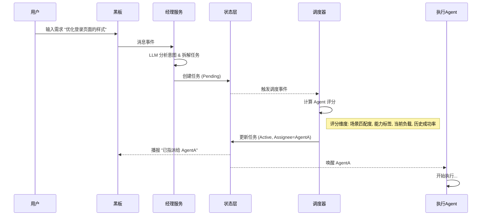
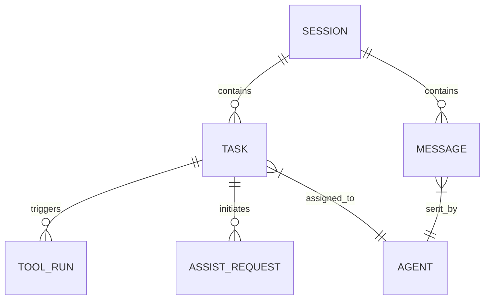

# VSCode Arranger 扩展 - 系统完整方案设计文档

> **版本**: 2.1.0
> **更新时间**: 2025-11-19
> **文档密级**: 内部公开

---

## 1. 系统概述

### 1.1 产品定位
VSCode Arranger 是一个**基于多 LLM 智能编排的团队级代码助手**。它突破了传统单 Agent 助手的限制，通过构建一个由"经理"（Manager）和"成员"（Workers）组成的虚拟研发团队，为开发者提供具备统筹规划、分工协作和自我纠错能力的智能编程体验。

### 1.2 核心设计理念
1.  **拟人化团队架构**：
    *   **经理 (Manager)**：负责意图识别、任务拆解、人员调度和质量把控。
    *   **成员 (Workers)**：具备不同专长（如编码、测试、文档）的 Agent，负责具体执行。
2.  **单一事实源 (SSOT)**：
    *   构建统一的**状态编排层 (StateStore)**，作为系统的心脏。
    *   所有 UI 展示、调度决策、工具执行状态均实时同步至 StateStore，确保数据一致性。
3.  **沉浸式协作体验**：
    *   **黑板 (Blackboard)**：群聊模式，用户作为团队一员参与讨论和验收。
    *   **工作台 (Workspace)**：单聊模式，聚焦特定 Agent 的执行细节和思考过程。
4.  **深度上下文感知**：
    *   集成 **ACE (Advanced Context Engine)**，实现全项目代码的语义索引。
    *   支持跨任务、跨会话的上下文自动关联与引用。
5.  **安全与可控**：
    *   统一的工具执行网关，内置敏感操作拦截机制。
    *   所有高风险行为（如删除文件、系统命令）均需用户显式确认。

---

## 2. 系统架构设计

系统采用清晰的分层架构，强调模块解耦与单向依赖。

```mermaid
graph TD
    subgraph Presentation [表现层]
        Blackboard[黑板界面 (群聊)]
        Workspace[Agent 工作台 (单聊)]
        TaskPanel[任务看板]
        ConfigPanel[配置中心]
        StatusBar[状态栏]
    end

    subgraph Application [应用层]
        ManagerService[经理编排服务]
        AgentService[Agent 管理服务]
        TaskService[任务服务]
        AssistService[协助服务]
        ToolExecService[工具执行服务]
        ContextService[上下文服务]
    end

    subgraph Domain [领域层]
        StateStore[状态编排层 (SSOT)]
        TaskEngine[任务状态机]
        AgentEngine[Agent 执行引擎]
        RiskEvaluator[风险评估器]
    end

    subgraph Infrastructure [基础设施层]
        DB[(SQLite 数据库)]
        LLMClient[LLM 客户端池]
        ACE[ACE 索引引擎]
        MCPServer[MCP 服务连接器]
        VSCodeAPI[VSCode API]
    end

    Presentation --> Application
    Application --> Domain
    Domain --> Infrastructure
```

### 2.1 核心组件详解

#### 2.1.1 状态编排层 (StateStore)
*   **核心职责**：系统的状态中枢，负责维护 Task, Assist, ToolRun, AgentHealth 等所有动态数据。
*   **机制**：
    *   **事件驱动**：基于 `TypedEventEmitter` 广播 `state:*` 事件（如 `state:task_updated`, `state:tool_run_added`）。
    *   **持久化**：状态变更实时写入 SQLite，同时在内存中维护热数据。
    *   **数据隔离**：支持按 Session 和 Workspace 进行状态隔离。

#### 2.1.2 经理编排服务 (ManagerOrchestrator)
*   **核心职责**：虚拟团队的"大脑"，负责决策与调度。
*   **工作流**：
    1.  **感知**：监听黑板消息流。
    2.  **思考**：调用经理 LLM 分析用户意图。
    3.  **决策**：生成结构化指令（创建任务、指派 Agent、发起协助）。
    4.  **反馈**：在黑板发布系统播报。

#### 2.1.3 Agent 执行引擎 (AgentEngine)
*   **核心职责**：虚拟团队的"手脚"，负责具体任务执行。
*   **能力**：
    *   **多模态执行**：支持代码编写、终端命令执行、MCP 工具调用。
    *   **思维链 (CoT)**：维护完整的思考过程记录。
    *   **自我修正**：执行出错时自动尝试修复或发起协助请求。

#### 2.1.4 工具执行服务 (ToolExecutionService)
*   **核心职责**：统一的工具调用网关与安全守门员。
*   **特性**：
    *   **统一接口**：屏蔽本地命令、MCP 工具、ACE 搜索的调用差异。
    *   **安全拦截**：基于策略拦截敏感命令，触发 `NeedsConfirm` 状态。
    *   **审计日志**：完整记录输入参数、输出结果和执行耗时。

---

## 3. 核心业务流程

### 3.1 智能任务调度流程



### 3.2 任务状态流转机制

任务状态机设计确保了任务全生命周期的可控性与可观测性。

*   **Pending (待处理)**：任务已创建，等待调度。
*   **Active (进行中)**：Agent 正在执行任务。
*   **NeedsConfirm (待确认)**：遇到敏感操作或关键决策，挂起等待用户确认。
*   **Blocked (阻塞)**：依赖未满足或资源不足。
*   **Reassigning (重分配)**：Agent 离线或执行失败，触发重新调度。
*   **Finalizing (总结中)**：执行完毕，正在生成验收报告。
*   **Done (已完成)**：任务结束。
*   **Failed (失败)**：任务最终失败。

### 3.3 协作与协助 (Assist) 机制

当 Agent 遇到无法独立解决的问题时，系统支持动态协作：

1.  **发起协助**：Agent A 发起 `AssistRequest`，描述需求（如"需要生成一张架构图"）。
2.  **经理介入**：经理评估请求，指派具备绘图能力的 Agent B。
3.  **独立上下文**：Agent B 在独立的协助上下文中执行任务，避免污染主任务上下文。
4.  **结果交付**：Agent B 完成后，将结果摘要和产物链接回传给 Agent A。
5.  **历史合并**：协助记录自动归档至主任务的历史记录中。

---

## 4. 数据模型设计

### 4.1 实体关系图 (ERD)



### 4.2 关键数据表定义

#### 4.2.1 任务表 (tasks)
| 字段名 | 类型 | 说明 |
| :--- | :--- | :--- |
| `id` | UUID | 任务唯一标识 |
| `session_id` | UUID | 所属会话 ID |
| `title` | String | 任务标题 |
| `status` | Enum | 任务状态 (Pending/Active/...) |
| `assignee` | String | 被指派的 Agent ID |
| `manager_id` | String | 创建该任务的经理 ID |
| `context_refs` | JSON | 关联的 ACE 上下文引用 |
| `priority` | Int | 优先级 (1-5) |
| `difficulty` | Int | 预估难度 (1-10) |

#### 4.2.2 工具运行表 (tool_runs)
| 字段名 | 类型 | 说明 |
| :--- | :--- | :--- |
| `id` | UUID | 运行记录 ID |
| `task_id` | UUID | 关联任务 ID |
| `agent_id` | String | 执行者 ID |
| `command` | String | 工具名称/命令 |
| `args` | JSON | 调用参数 |
| `output` | Text | 执行结果/错误信息 |
| `status` | Enum | 运行状态 (Running/Success/Failed) |
| `risk_level` | Enum | 风险等级 (High/Medium/Low) |

---

## 5. 用户界面 (UI) 设计方案

### 5.1 黑板 (Blackboard)
*   **设计隐喻**：团队作战室的白板。
*   **功能**：
    *   **全局视野**：展示所有成员的讨论、系统播报和任务状态变更。
    *   **混合排版**：支持 Markdown 渲染、代码块高亮、任务卡片嵌入。
    *   **快捷指令**：支持 `/task` 创建任务，`@Agent` 唤起成员。

### 5.2 Agent 工作台 (Workspace)
*   **设计隐喻**：与特定同事的一对一私聊窗口。
*   **功能**：
    *   **专注模式**：仅展示当前 Agent 的上下文。
    *   **思维链可视化**：支持折叠/展开 Agent 的思考过程 (Thinking Process)。
    *   **工具调用详情**：以卡片形式展示工具调用的输入输出，便于调试。

### 5.3 状态栏与通知
*   **状态栏**：
    *   显示当前活跃任务数。
    *   显示 ACE 索引状态 (Indexing/Ready)。
    *   显示经理 LLM 的健康状态。
*   **通知系统**：
    *   任务完成/失败通知。
    *   敏感操作确认弹窗。
    *   协助请求通知。

---

## 6. 安全与隐私设计

### 6.1 敏感操作控制 (KeywordPolicy)
系统内置三级风险控制策略：

*   **High (高危)**：如 `rm -rf`, `drop table`, `shutdown`。必须用户显式弹窗确认，不可跳过。
*   **Medium (中风险)**：如 `git push`, `npm publish`。默认需要确认，用户可配置白名单。
*   **Low (低风险)**：如 `ls`, `cat`, `echo`。自动放行，仅记录日志。

### 6.2 数据隐私
*   **本地优先**：所有代码索引 (ACE) 和数据库文件均存储在用户本地 (`.arranger/`)。
*   **密钥管理**：LLM API Key 使用 VSCode SecretStorage 加密存储。
*   **网络隔离**：除 LLM API 调用外，不主动向外部发送任何数据。

---

## 7. 技术栈选型

*   **扩展宿主**：VSCode Extension API
*   **语言**：TypeScript 5.x
*   **运行时**：Node.js (VSCode 内置环境)
*   **数据库**：SQLite (via `better-sqlite3`)
*   **通信协议**：
    *   内部：TypedEventEmitter
    *   UI：JSON-RPC
    *   外部：MCP (Model Context Protocol)
*   **前端框架**：React (Webview) + Tailwind CSS

---

## 8. 总结

本设计方案通过构建一个具备高度自治能力的虚拟研发团队，将 AI 辅助编程从"单点工具"升级为"组织化协作"。通过统一的状态编排、智能的经理调度和安全的执行环境，VSCode Arranger 能够处理更复杂、更长链路的研发任务，为开发者提供可靠、高效的编程伙伴。